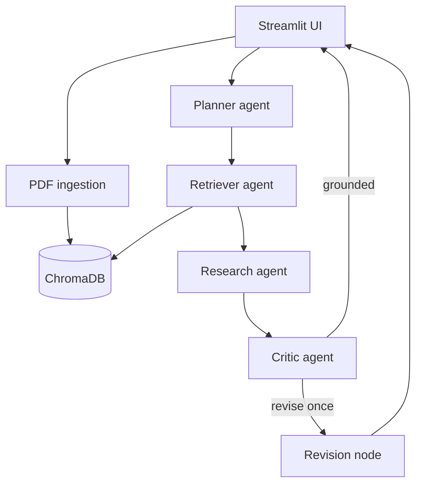

# ResearchFlow AI

A complete Streamlit application that turns a LangGraph + ChromaDB RAG notebook into a usable
research workspace. Upload PDF papers, ask grounded questions, generate summaries, compare
approaches, inspect source passages, and view the agent execution trace.

## What is included

- Polished Streamlit interface with chat, paper library, and workflow views
- Multi-PDF ingestion with validation, metadata extraction, deduplication, and chunking
- Local CPU embeddings using ChromaDB's `all-MiniLM-L6-v2` default embedding function
- Persistent ChromaDB vector storage
- LangGraph workflow: planner → retriever → researcher → critic → optional revision
- Groq and OpenRouter support through their OpenAI-compatible APIs
- Server-managed API keys; end users never enter or see provider credentials
- Inline citations and expandable evidence excerpts
- Per-browser-session Chroma collection isolation
- Environment/Streamlit secrets support with no keys in source code
- Docker, Docker Compose, automated tests, linting, and GitHub Actions CI

## Architecture



The workflow combines four useful agentic patterns:

1. **Router/planner** — selects ask, summarize, or compare.
2. **Tool use** — the retriever queries ChromaDB.
3. **Orchestrator–worker** — LangGraph coordinates specialized nodes through typed shared state.
4. **Reflection** — the critic checks citations and requests one correction when needed.

## Project structure

```text
research-paper-assistant/
├── app.py
├── assets/
│   └── styles.css
├── src/research_assistant/
│   ├── config.py
│   ├── domain.py
│   ├── ingestion.py
│   ├── llm.py
│   ├── prompts.py
│   ├── vector_store.py
│   └── workflow.py
├── tests/
├── scripts/
├── sample_data/
├── .streamlit/
│   ├── config.toml
│   └── secrets.toml.example
├── .github/workflows/ci.yml
├── Dockerfile
├── docker-compose.yml
├── requirements.txt
└── pyproject.toml
```

## Local setup

### 1. Create and activate a virtual environment

Windows PowerShell:

```powershell
python -m venv .venv
.\.venv\Scripts\Activate.ps1
```

macOS/Linux:

```bash
python3 -m venv .venv
source .venv/bin/activate
```

### 2. Install dependencies

```bash
python -m pip install --upgrade pip
pip install -r requirements.txt
```

The first paper-processing run downloads the local MiniLM embedding model. A GPU is not required.

### 3. Add API keys

Create the local secrets file:

Windows PowerShell:

```powershell
Copy-Item .streamlit\secrets.toml.example .streamlit\secrets.toml
```

macOS/Linux:

```bash
cp .streamlit/secrets.toml.example .streamlit/secrets.toml
```

Edit `.streamlit/secrets.toml` and add at least one real key:

```toml
GROQ_API_KEY = "gsk_..."
OPENROUTER_API_KEY = "sk-or-v1-..."
```

If both keys are present, Groq's fast model handles planning/critique while the provider selected
in the sidebar handles the final research answer. If only one key is present, that provider handles
the entire workflow.

The secrets file belongs to the app owner. End users do not enter API keys in the interface, and
provider keys are never displayed in the browser.

### 4. Run the application

```bash
streamlit run app.py
```

Open `http://localhost:8501`.

## How to use

1. Upload one or more searchable research-paper PDFs.
2. Select **Process papers** and wait for the indexed-paper confirmation.
3. Choose **Ask**, **Summarize**, **Compare**, or **Auto**.
4. Enter a question in the chat box.
5. Expand **Evidence used** to inspect the exact retrieved passages and page numbers.
6. Open **Workflow** to inspect the latest agent trace.

Scanned image-only PDFs require OCR before upload.

## Model configuration

Defaults are intentionally editable because provider catalogs change.

| Task | Default | Reason |
|---|---|---|
| Planning and critique | Groq `llama-3.1-8b-instant` | Low latency for routing and short audits |
| Final answer on Groq | Groq `llama-3.3-70b-versatile` | Stronger synthesis quality |
| Final answer on OpenRouter | `openai/gpt-oss-20b` | Accessible general-purpose reasoning model |
| Embeddings | Local `all-MiniLM-L6-v2` | CPU-friendly, no embedding API cost |

Change model IDs in the sidebar, `.streamlit/secrets.toml`, or environment variables.

## Docker

Create `.env` from `.env.example`, add your real keys, then run:

```bash
docker compose up --build
```

Open `http://localhost:8501`. Chroma data is retained in the `chroma_data` Docker volume.

## Deploy to Streamlit Community Cloud

1. Push this folder to a GitHub repository.
2. In Streamlit Community Cloud, choose **Create app** → **Deploy a public app from GitHub**.
3. Select the repository, branch, and `app.py`.
4. Open **Advanced settings** → **Secrets** and paste:

```toml
GROQ_API_KEY = "gsk_..."
OPENROUTER_API_KEY = "sk-or-v1-..."
```

5. Deploy the app.

Streamlit Community Cloud has an ephemeral filesystem. The app works normally during a running
session, but indexed PDFs may disappear after the app restarts. For permanent shared storage,
connect ChromaDB to a persistent external service in a later production version.

## Test and lint

```bash
pip install -r requirements-dev.txt
ruff check .
pytest
python scripts/smoke_check.py
```

## Notebook-to-application mapping

| Notebook behavior | Application location |
|---|---|
| Install/import cells | `requirements.txt` and package modules |
| PDF loading | `ingestion.py` |
| Text chunking | `split_text()` in `ingestion.py` |
| Embeddings and ChromaDB | `vector_store.py` |
| Groq/OpenRouter calls | `llm.py` |
| LangGraph state and nodes | `workflow.py` |
| Test question and answer | Streamlit research chat |
| Retrieved context display | Expandable **Evidence used** section |

## Security and reliability

- Keys are read from environment variables or Streamlit secrets and are excluded by `.gitignore`.
- Uploaded PDF contents are treated as untrusted evidence, not instructions.
- The answer prompt requires source-linked claims and admits when evidence is insufficient.
- Files are limited to PDF and 30 MB each.
- Each browser session receives a separate Chroma collection.

## Troubleshooting

**The UI says an API key is missing**  
The app owner must add the provider key to `.streamlit/secrets.toml` locally or to the Streamlit
Community Cloud **Secrets** settings for a deployed app.

**The provider says the model does not exist**  
Model catalogs change. Copy a current model ID from Groq/OpenRouter and paste it into the sidebar.

**A PDF has no searchable text**  
It is probably scanned. Use an OCR tool, export a searchable PDF, and upload it again.

**The first indexing run is slow**  
Chroma downloads the local embedding model once. Later runs reuse the cached model.

**Docker cannot find `.env`**  
Copy `.env.example` to `.env` before running `docker compose up --build`.

## Known limitations

- PDF tables and multi-column layouts may extract imperfectly.
- Citation quality depends on PDF text extraction and retrieval relevance.
- The critic performs one revision, not an unlimited agent loop.
- Local Chroma persistence is not durable across Streamlit Community Cloud restarts.
